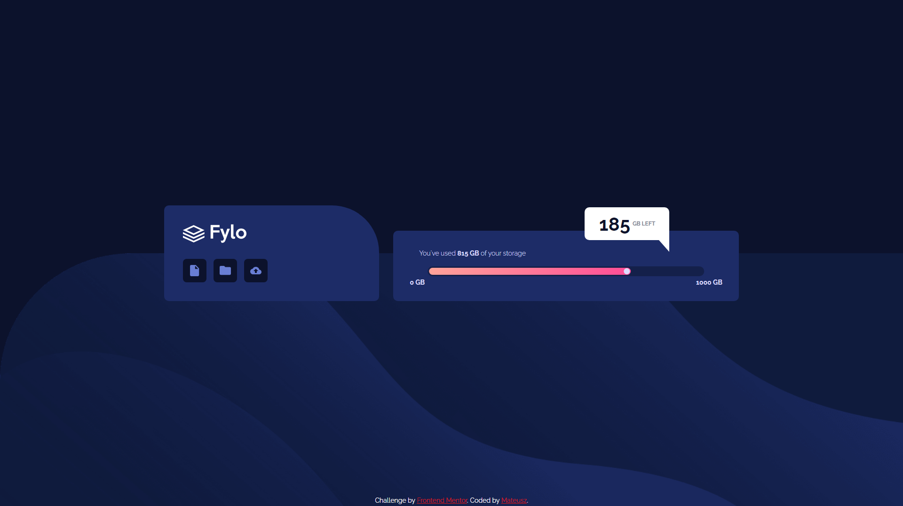

# Frontend Mentor - Fylo data storage component solution
This is a solution to the "Fylo data storage component" challenge on [Frontend Mentor](https://www.frontendmentor.io/challenges/fylo-data-storage-component-1dZPRbV5n).

## The challenge
Your challenge is to build out this data storage component and get it looking as close to the design as possible.

You can use any tools you like to help you complete the challenge. So if you've got something you'd like to practice, feel free to give it a go.

Your users should be able to:

-  View the optimal layout for the site depending on their device's screen size
## Screenshots
#### 1440px

#### 375px

## 🔗 Links
- Solution URL: [click here](https://www.frontendmentor.io/solutions/fylodatastoragecomponent-pzF-zBjBNJ)
- Live URL: [click here](https://mateuszhofman.github.io/fylo-data-storage-component.github.io/)
## Author

- Frontend Mentor: [@mateuszhofman](https://www.frontendmentor.io/profile/mateuszhofman)
- Linkedin: [@mateusz-hofman](https://www.linkedin.com/in/mateusz-hofman-b815502a8/)

